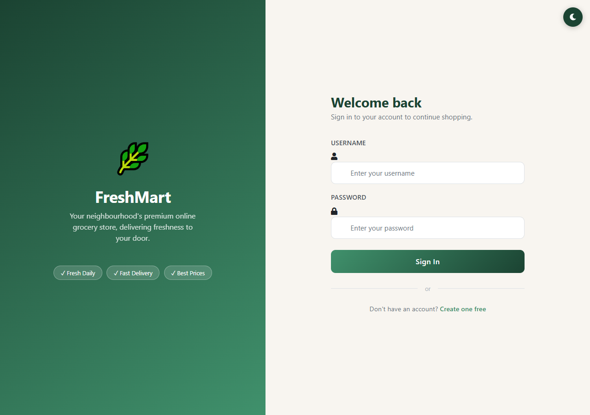
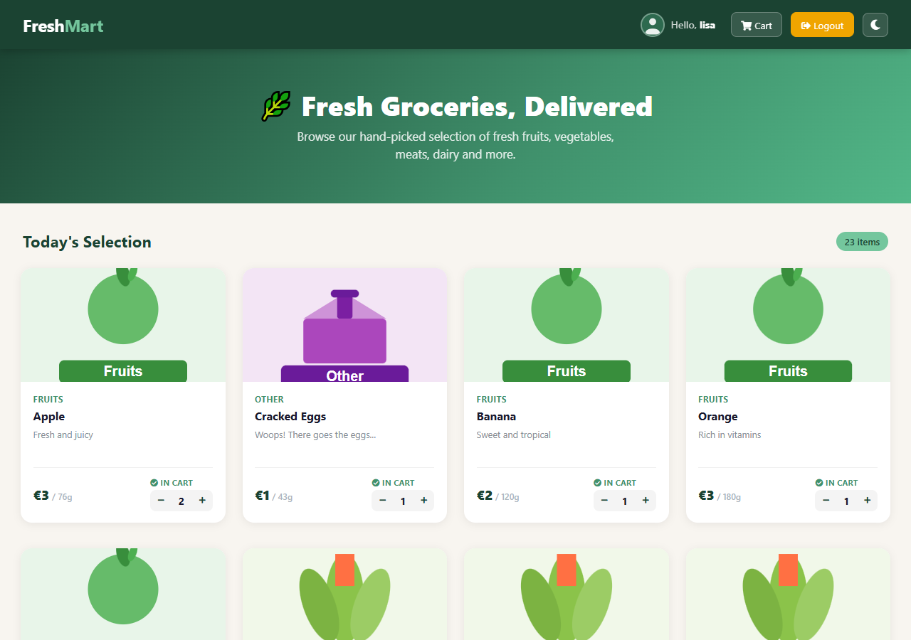
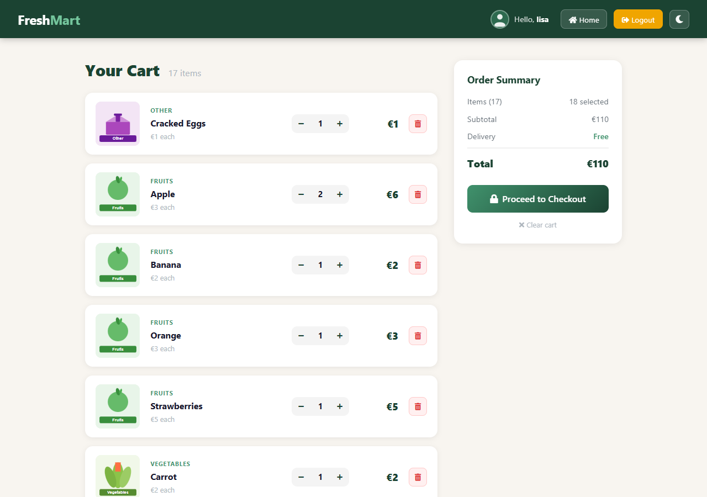
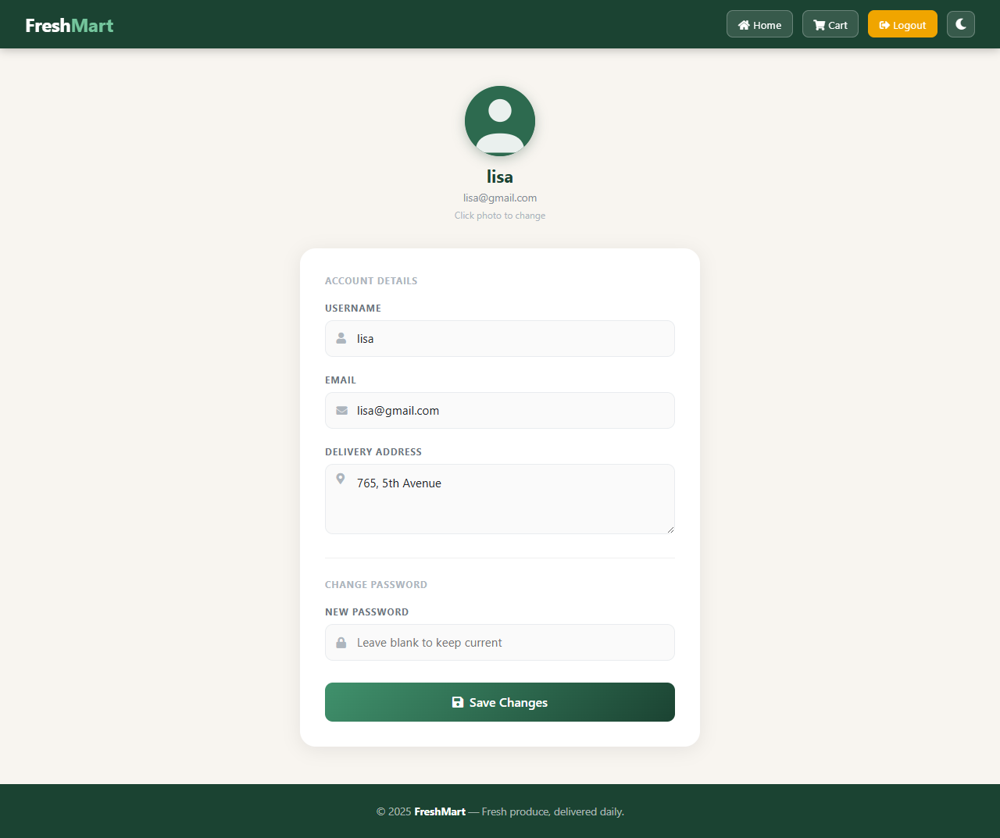
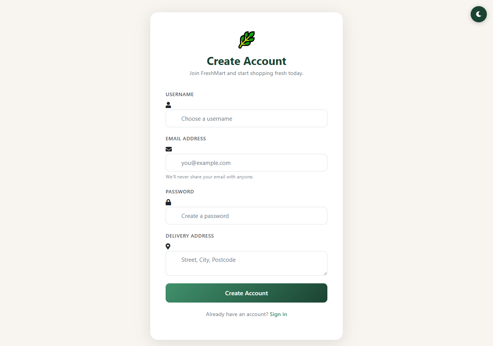

# FreshMart — Fresh Groceries, Delivered

A full-stack e-commerce web application for fresh groceries, built with Spring Boot and deployed on Render.

## Features

- **Product catalogue** with categories, descriptions, weights and prices
- **Shopping cart** — add, increase/decrease quantity, remove items
- **User accounts** — register, login, update profile with avatar photo
- **Admin panel** — manage products, categories and customers
- **Dark mode** — persisted per device via `localStorage`
- **Mobile responsive** — optimised for phones, tablets and desktop
- **Configurable currency** — set via `application.yml` (default: €)
- **Configurable product catalogue** — edit products and prices in `application.yml` without touching the database

## Tech Stack

| Layer | Technology |
|-------|-----------|
| Backend | Spring Boot 3.5, Java 21 |
| Security | Spring Security (BCrypt) |
| Persistence | Spring Data JPA + Flyway migrations |
| Database | H2 (local) · PostgreSQL (production) |
| Views | JSP + JSTL |
| Frontend | Bootstrap 4, Font Awesome 5 |
| Deployment | Docker · Render |

## Screenshots

### Login


### Shop


### Cart


### Profile


### Register


## Quickstart (local)

```bash
# Clone
git clone https://github.com/georgiradev/freshmart.git
cd freshmart

# Run (H2 in-memory DB — no setup needed)
mvn spring-boot:run
```

Open [http://localhost:8080](http://localhost:8080)

Default credentials:

| Role | Username | Password |
|------|----------|----------|
| Admin | `admin` | `123` |
| User | `lisa` | `765` |

## Configuration

### Currency
Edit `src/main/resources/application.yml`:
```yaml
app:
  currency:
    symbol: "€"   # change to $ or any symbol
```

### Products & prices
All products are defined in `application.yml` under `catalog.products`. Changes take effect on the next restart — no SQL edits needed.

```yaml
catalog:
  products:
    - name: "Apple"
      description: "Fresh and juicy"
      price: 3
      weight: 76
      category: "Fruits"
      image: "/images/fruits.svg"
```

### IntelliJ IDEA
Set the run configuration's **Working Directory** to `$MODULE_WORKING_DIR$` so JSP views are found at runtime.

## Deploy to Render

The repository includes a `render.yaml` for one-click deployment:

1. Push this repo to your GitHub account
2. Go to [render.com](https://render.com) → **New** → **Blueprint**
3. Connect your GitHub repo — Render will auto-detect `render.yaml`
4. It provisions a free PostgreSQL database and web service automatically
5. First deploy takes ~5 minutes for the Docker build

Environment variables are injected automatically from the linked database.

## Project Structure

```
src/
├── main/
│   ├── java/com/jtspringproject/
│   │   ├── controller/     # AdminController, UserController
│   │   ├── services/       # Business logic
│   │   ├── dao/            # Spring Data JPA repositories
│   │   ├── models/         # JPA entities (User, Product, Category, Cart, CartProduct)
│   │   └── configuration/  # Security, Hibernate config, GlobalModelAttributes
│   ├── resources/
│   │   ├── db/migration/   # Flyway SQL migrations (V1–V8)
│   │   ├── static/         # CSS, JS, images
│   │   ├── application.properties   # Local (H2) config
│   │   ├── application.yml          # Catalog & currency config
│   │   └── application-prod.yml     # Production (PostgreSQL) config
│   └── webapp/views/       # JSP templates
├── Dockerfile
└── render.yaml
```

## Endpoints

| URL | Description |
|-----|-------------|
| `/` | Product catalogue (requires login) |
| `/register` | Create account |
| `/login` | User login |
| `/cart` | Shopping cart |
| `/profileDisplay` | View profile |
| `/updateProfile` | Edit profile & avatar |
| `/admin/Dashboard` | Admin overview |
| `/admin/products` | Manage products |
| `/admin/categories` | Manage categories |
| `/admin/customers` | Manage customers |
